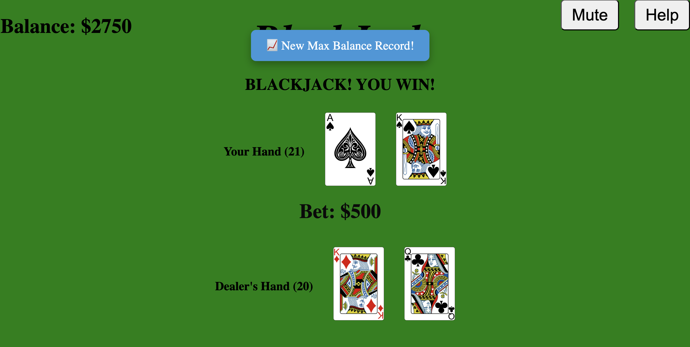

# 🃏 Blackjack Game

## 🎮 Introduction

Welcome to my **Blackjack Game** — a full-stack implementation of the classic casino card game. Built using **React** (JavaScript) for the frontend and **Flask** (Python) for the backend, this application lets you play against a dealer with proper Blackjack rules and an interactive UI.

Your goal is simple: **get as close to 21 as possible** without going over, and beat the dealer.

---

## 🖼️ Game Preview

  

---

## 🎮 Play the Game
You can try the game live here:
🔗 https://blackjack-app-g8kl.onrender.com

⚠️ Note: This hosted version may feel a bit slower than running it locally. This is due to server latency and cold starts on the free hosting tier. For the best experience, clone the repo and run it locally using the instructions below.

---

## 🚀 Features

- ✅ **Play against a dealer** with classic Blackjack rules
- 🃏 **Face-down dealer card** until the player ends their turn
- 🧠 **Game logic handled in Python** with deck, player, and dealer management
- 🎨 **React frontend** dynamically renders cards and scores
- 👇 Interactive controls for:
  - **Hit** – take another card
  - **Stand** – end your turn and let the dealer play
  - **Double** – double your bet, receive one card, and end your turn
  - **Split** - split your hand into 2 if you have a pair
  - **Rebet** – repeat your last bet with a single click
  - **Insurance** – if the dealer shows an Ace, you can place a side bet to protect against a dealer Blackjack
  - **Cash Out** – view your session summary including final money, max money reached, hands won, and net earnings
  - **Mute/Unmute** – toggle background music and sound effects

🔊 Audio effects for card dealing and blackjack  
♠️ ♥️ Visual card graphics with animated dealing one card at a time  
🔄 Stateful gameplay with:
- Automatic bust detection  
- Blackjack vs. 21 distinction after splits  
- Split hands managed independently with separate results  
📈 Persistent Session tracking:
- Starting money ($2000)
- Bet management and chip selection
- Tracks hands won and highest money reached
- Highest balance reached (max money)
- Highest cashout value
- Insurance bets reflected in session money
📉 Bankruptcy screen when money hits $0

- ⚙️ **Custom Game Options**:
  - Choose number of decks (1, 2, 4, 6, 8)
  - Enable/disable **Dealer Hits on Soft 17**
  - Options persist between games

---

## ⚙️ Tech Stack

- **Frontend**: React (JavaScript)
- **Backend**: Flask (Python)
- **Communication**: RESTful API via `fetch`

---

## 🧩 Gameplay Notes

- Dealer's second card remains hidden until the player's turn ends.
- Aces are treated as both 1/11, whichever is more helpful to the player.
- Deck is reshuffled each round.
- After splitting, Blackjack is no longer possible — a 21 is just treated as a strong hand.
- Double and Split actions require sufficient funds.
- Cards are dealt one at a time with visual and audio feedback.
- Game options (deck count & dealer rules) are saved between sessions.
- Insurance is offered when the dealer shows an Ace, and the player has enough money. If the dealer has Blackjack, the insurance bet pays 2:1. Otherwise, it’s lost.
---

## 🛠 Setup Instructions

To run the Blackjack Game locally, 
1. Clone the repository and navigate to the root directory. Set up and activate a virtual environment if desired (python -m venv venv && source venv/bin/activate on Mac/Linux or venv\Scripts\activate on Windows).
2. Navigate to the backend folder (cd flask-server) and install dependencies with pip install Flask, then start the Flask server using python server.py or python3 server.py (it will run at http://localhost:5000).
3. In a new terminal, navigate to the frontend folder (cd client), install frontend dependencies with npm install, and start the React development server using npm start (it will run at http://localhost:3000). Make sure the frontend fetch requests are pointing to localhost:5000. Once both servers are running, open your browser and play the game at http://localhost:3000.
